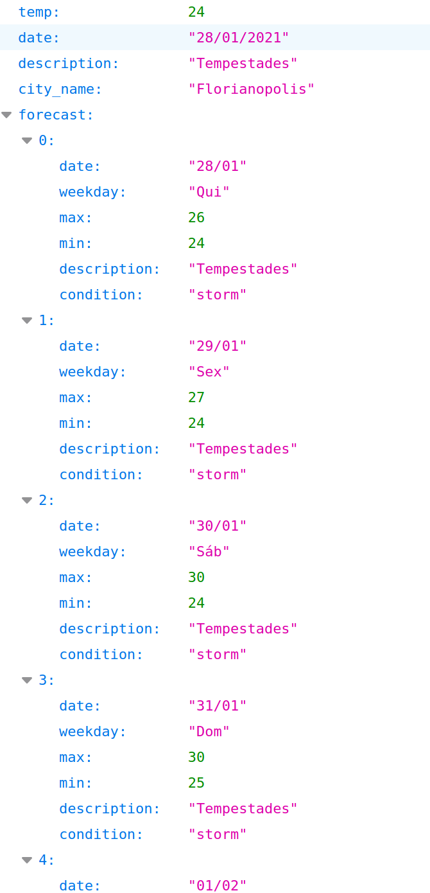
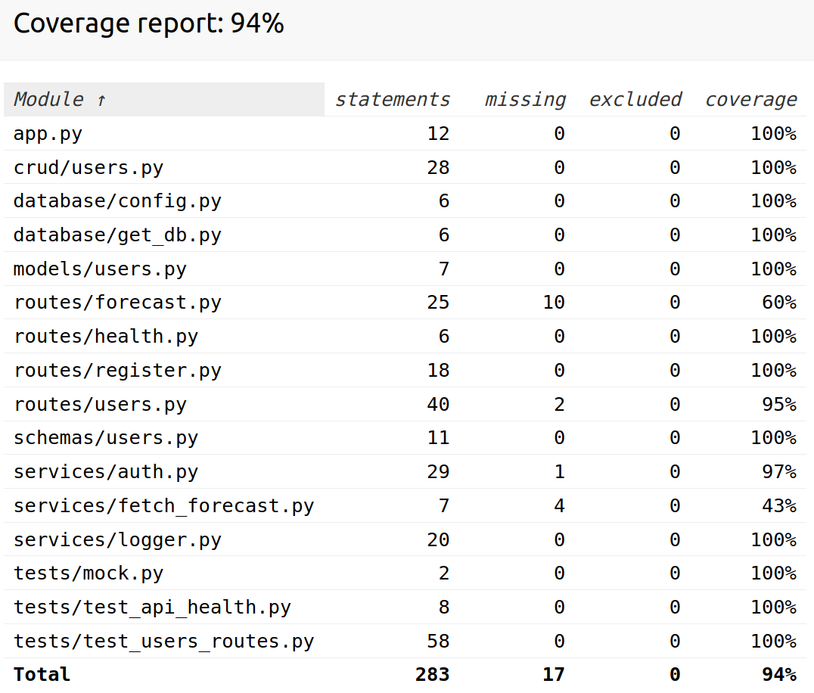
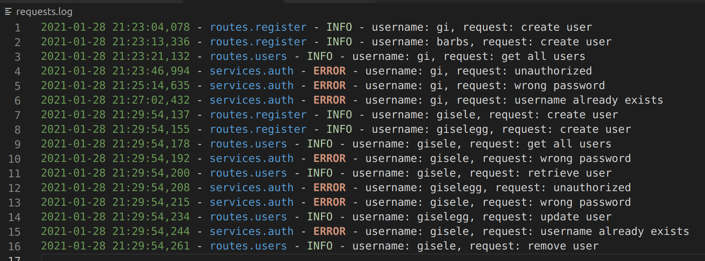

# Weather Forecast API

API para consultar a previsão do tempo, filtrando por cidade, para 7 dias.

## Requerimentos

- Python 3.8.5
- Libs: requirements.txt

- Criar uma chave na HG Weather para consulta pública:
https://console.hgbrasil.com/keys

## Como usar
### 1 Baixar projeto
```
git clone https://github.com/giselegg/forecast-api
```

### 2 Chave da API da HG Weather
Salvar a chave num arquivo .env na variável KEY

exemplo:
KEY=1234

### 3a Com Docker
- Criar o container:
```
docker build -t forecast-api .
```

- Subir o container:
```
docker run -p 8000:8000 forecast-api
```

### 3b Sem Docker
- Criar ambiente virtual:
```
python3 -m venv env
```

- Ativá-lo:
```
source env/bin/activate
```

- Instalar Requirements:
```
pip install -r requirements.txt
```

- Rodar API:
```
uvicorn app:app --reload
```

### 4 Testar saúde da API (opcional)
Para testar a saúde da API, ao fazer a seguinte requisição, deve-se retornar um timestamp atual.

```
[GET] http://localhost:8000/health
```

### 5 Registrar usuário (obrigatório)
Para se verificar a previsão do tempo é necessário primeiro registrar um usuário.

Enviar JSON com:
```
{
    "username": <nome_usuario>,
    "password": <senha>,
}
```

para:
```
[POST] http://localhost:8000/register/
```

### 6 Consultar previsão do tempo

Através de autenticação HTTP Basic com os dados do usuário criado no item 5, a previsão pode ser consultado no seguinte endereço:

```
[GET] http://localhost:8000/forecast/<city_name>
```



### 7 CRUD usuários
Todos os endpoints a seguir necessitam de autenticação.

**Retornar todos os usuários**
```
[GET] http://localhost:8000/users/
```

**Retornar um usuário**
```
[GET] http://localhost:8000/users/<id>
```

**Remover usuário**
```
[DELETE] http://localhost:8000/users/<id>
```

**Atualizar usuário**

Enviar JSON com:
```
{
    "username": <nome_usuario>,
    "password": <senha>,
}
```
para:
```
[PUT] http://localhost:8000/users/<id>
```

**Atenção:** O usuário pode retornar, remover ou atualizar apenas o seu próprio usuário!

## Testes unitários
Para rodar todos os testes:
```
python3 -m pytest
```

Cobertura atual:


## Log das requisições
Todas as requisições feitas pelos usuários ficam salvas em requests.logs.

Exemplo:


## Fonte
**[API Externa] HG Weather**
https://hgbrasil.com/status/weather

## That's all folks!

